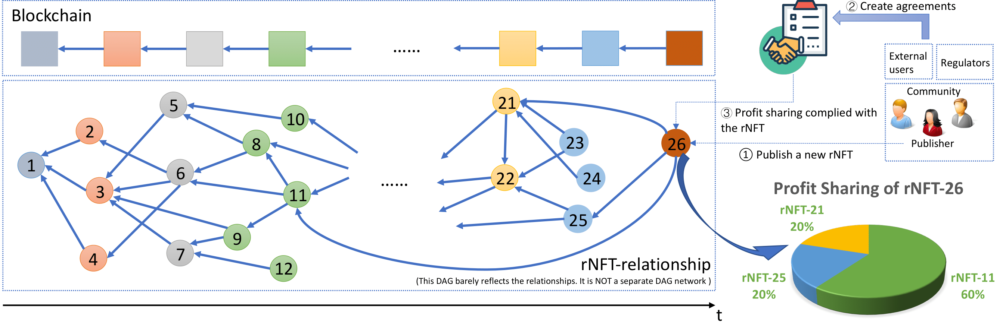

# EIP-5521

[TOC]

ERC-5521：可引用的 NFT(Referable NFT)

ERC-721 扩展，用于构建 NFT 之间的引用关系

## 概述

本标准是 ERC-721 的扩展。它提出了两个可引用的指标，引用和被引用，以及一个基于时间的指标 createdTimestamp 。每个 NFT 之间的关系形成一个有向无环图 （DAG）。该标准允许用户查询、跟踪和分析他们的关系。




读了一下EIP和他们的论文，有点云里雾里的，读一下代码

github上提交的代码不太行，是同一个collection的token id相互引用，和论文里写的一样...

总结一下，就是可以让用户创建一个nft的时候构建对其他token的引用，可以更方便的做利润分成之类的操作。

```solidity
pragma solidity ^0.8.4;

import "@openzeppelin/contracts/utils/introspection/IERC165.sol";

interface IERC_5521 is IERC165 {

    /// Logged when a node in the rNFT gets referred and changed.
    /// @notice Emitted when the `node` (i.e., an rNFT) is changed.
    event UpdateNode(uint256 indexed tokenId, 
                     address indexed owner, 
                     address[] _address_referringList,
                     uint256[][] _tokenIds_referringList,
                     address[] _address_referredList,
                     uint256[][] _tokenIds_referredList
    );

    /// @notice set the referred list of an rNFT associated with different contract addresses and update the referring list of each one in the referred list. Checking the duplication of `addresses` and `tokenIds` is **RECOMMENDED**.
    /// @param `tokenId` of rNFT being set. `addresses` of the contracts in which rNFTs with `tokenIds` being referred accordingly. 
    /// @requirement 
    /// - the size of `addresses` **MUST** be the same as that of `tokenIds`;
    /// - once the size of `tokenIds` is non-zero, the inner size **MUST** also be non-zero;
    /// - the `tokenId` **MUST** be unique within the same contract;
    /// - the `tokenId` **MUST NOT** be the same as `tokenIds[i][j]` if `addresses[i]` is essentailly `address(this)`.
    function setNode(uint256 tokenId, address[] memory addresses, uint256[][] memory tokenIds) external;

    /// @notice get the referring list of an rNFT.
    /// @param `tokenId` of the rNFT being focused, `_address` of contract address associated with the focused rNFT.
    /// @return the referring mapping of the rNFT.
    function referringOf(address _address, uint256 tokenId) external view returns(address[] memory, uint256[][] memory);

    /// @notice get the referred list of an rNFT.
    /// @param `tokenId` of the rNFT being focused, `_address` of contract address associated with the focused rNFT.
    /// @return the referred mapping of the rNFT.
    function referredOf(address _address, uint256 tokenId) external view returns(address[] memory, uint256[][] memory);
    
    /// @notice check supported interfaces, adhereing to ERC165.
    function supportsInterface(bytes4 interfaceId) external view returns (bool);
}

interface TargetContract is IERC165 {
    /// @notice set the referred list of an rNFT associated with external contract addresses. 
    /// @param `_tokenIds` of rNFTs associated with the contract address `_address` being referred by the rNFT with `tokenId`.
    /// @requirement
    /// - `_address` **MUST NOT** be the same as `address(this)` where `this` is executed by an external contract where `TargetContract` interface is implemented.
    function setNodeReferredExternal(address _address, uint256 tokenId, uint256[] memory _tokenIds) external;

    function referringOf(address _address, uint256 tokenId) external view returns(address[] memory, uint256[][] memory);

    function referredOf(address _address, uint256 tokenId) external view returns(address[] memory, uint256[][] memory);
    
    function supportsInterface(bytes4 interfaceId) external view returns (bool);
}
```

```solidity
pragma solidity ^0.8.4;

import "@openzeppelin/contracts/token/ERC721/ERC721.sol";
import "./IERC_5521.sol";

contract ERC_5521 is ERC721, IERC_5521, TargetContract {

    struct Relationship {
        mapping (address => uint256[]) referring;
        mapping (address => uint256[]) referred;
        address[] referringKeys;
        address[] referredKeys;
        uint256 createdTimestamp; // unix timestamp when the rNFT is being created

        // extensible parameters
        // ...
    }

    mapping (uint256 => Relationship) internal _relationship;
    address contractOwner = address(0);

    constructor(string memory name_, string memory symbol_) ERC721(name_, symbol_) {
        contractOwner = msg.sender;
    }

    function safeMint(uint256 tokenId, address[] memory addresses, uint256[][] memory _tokenIds) public {
        // require(msg.sender == contractOwner, "ERC_rNFT: Only contract owner can mint");
        _safeMint(msg.sender, tokenId);
        setNode(tokenId, addresses, _tokenIds);
    }

    /// @notice set the referred list of an rNFT associated with different contract addresses and update the referring list of each one in the referred list
    /// @param tokenIds array of rNFTs, recommended to check duplication at the caller's end
    function setNode(uint256 tokenId, address[] memory addresses, uint256[][] memory tokenIds) public virtual override {
        require(
            addresses.length == tokenIds.length,
            "Addresses and TokenID arrays must have the same length"
        );
        for (uint i = 0; i < tokenIds.length; i++) {
            if (tokenIds[i].length == 0) { revert("ERC_5521: the referring list cannot be empty"); }
        }
        setNodeReferring(addresses, tokenId, tokenIds);
        setNodeReferred(addresses, tokenId, tokenIds);
    }

    /// @notice set the referring list of an rNFT associated with different contract addresses 
    /// @param _tokenIds array of rNFTs associated with addresses, recommended to check duplication at the caller's end
    function setNodeReferring(address[] memory addresses, uint256 tokenId, uint256[][] memory _tokenIds) private {
        require(_isApprovedOrOwner(msg.sender, tokenId), "ERC_5521: transfer caller is not owner nor approved");

        Relationship storage relationship = _relationship[tokenId];

        for (uint i = 0; i < addresses.length; i++) {
            if (relationship.referring[addresses[i]].length == 0) { relationship.referringKeys.push(addresses[i]); } // Add the address if it's a new entry
            relationship.referring[addresses[i]] = _tokenIds[i];
        }

        relationship.createdTimestamp = block.timestamp;
        emitEvents(tokenId, msg.sender);
    }

    /// @notice set the referred list of an rNFT associated with different contract addresses 
    /// @param _tokenIds array of rNFTs associated with addresses, recommended to check duplication at the caller's end
    function setNodeReferred(address[] memory addresses, uint256 tokenId, uint256[][] memory _tokenIds) private {
        for (uint i = 0; i < addresses.length; i++) {
            if (addresses[i] == address(this)) {
                for (uint j = 0; j < _tokenIds[i].length; j++) {
                    Relationship storage relationship = _relationship[_tokenIds[i][j]];
                    if (relationship.referred[addresses[i]].length == 0) { relationship.referredKeys.push(addresses[i]); } // Add the address if it's a new entry
                    
                    require(tokenId != _tokenIds[i][j], "ERC_5521: self-reference not allowed");
                    if (relationship.createdTimestamp >= block.timestamp) { revert("ERC_5521: the referred rNFT needs to be a predecessor"); } // Make sure the reference complies with the timing sequence

                    relationship.referred[address(this)].push(tokenId);
                    emitEvents(_tokenIds[i][j], ownerOf(_tokenIds[i][j]));
                }
            } else {
                TargetContract targetContractInstance = TargetContract(addresses[i]);
                bool isSupports = targetContractInstance.supportsInterface(type(TargetContract).interfaceId);
                if (isSupports) {
                    // The target contract supports the interface, safe to call functions of the interface.
                    targetContractInstance.setNodeReferredExternal(address(this), tokenId, _tokenIds[i]);
                }
            }
        }
    }

    /// @notice set the referred list of an rNFT associated with different contract addresses 
    /// @param _tokenIds array of rNFTs associated with addresses, recommended to check duplication at the caller's end
    function setNodeReferredExternal(address _address, uint256 tokenId, uint256[] memory _tokenIds) external {
        for (uint i = 0; i < _tokenIds.length; i++) {
            Relationship storage relationship = _relationship[_tokenIds[i]];
            if (relationship.referred[_address].length == 0) { relationship.referredKeys.push(_address); } // Add the address if it's a new entry

            require(_address != address(this), "ERC_5521: this must be an external contract address");
            if (relationship.createdTimestamp >= block.timestamp) { revert("ERC_5521: the referred rNFT needs to be a predecessor"); } // Make sure the reference complies with the timing sequence

            relationship.referred[_address].push(tokenId);
            emitEvents(_tokenIds[i], ownerOf(_tokenIds[i]));
        }
    }

    /// @notice Get the referring list of an rNFT
    /// @param tokenId The considered rNFT, _address The corresponding contract address
    /// @return The referring mapping of an rNFT
    function referringOf(address _address, uint256 tokenId) external view virtual override(IERC_5521, TargetContract) returns (address[] memory, uint256[][] memory) {
        address[] memory _referringKeys;
        uint256[][] memory _referringValues;

        if (_address == address(this)) {
            require(_exists(tokenId), "ERC_5521: token ID not existed");
            (_referringKeys, _referringValues) = convertMap(tokenId, true);
        } else {
            TargetContract targetContractInstance = TargetContract(_address);
            require(targetContractInstance.supportsInterface(type(TargetContract).interfaceId), "ERC_5521: target contract not supported");
            (_referringKeys, _referringValues) = targetContractInstance.referringOf(_address, tokenId);     
        }      
        return (_referringKeys, _referringValues);
    }

    /// @notice Get the referred list of an rNFT
    /// @param tokenId The considered rNFT, _address The corresponding contract address
    /// @return The referred mapping of an rNFT
    function referredOf(address _address, uint256 tokenId) external view virtual override(IERC_5521, TargetContract) returns (address[] memory, uint256[][] memory) {
        address[] memory _referredKeys;
        uint256[][] memory _referredValues;

        if (_address == address(this)) {
            require(_exists(tokenId), "ERC_5521: token ID not existed");
            (_referredKeys, _referredValues) = convertMap(tokenId, false);
        } else {
            TargetContract targetContractInstance = TargetContract(_address);
            require(targetContractInstance.supportsInterface(type(TargetContract).interfaceId), "ERC_5521: target contract not supported");
            (_referredKeys, _referredValues) = targetContractInstance.referredOf(_address, tokenId);           
        }
        return (_referredKeys, _referredValues);
    }

    /// @dev See {IERC165-supportsInterface}.
    function supportsInterface(bytes4 interfaceId) public view virtual override (ERC721, IERC_5521, TargetContract) returns (bool) {
        return interfaceId == type(IERC_5521).interfaceId
            || interfaceId == type(TargetContract).interfaceId
            || super.supportsInterface(interfaceId);    
    }

    // @notice Emit an event of UpdateNode
    function emitEvents(uint256 tokenId, address sender) private {
        (address[] memory _referringKeys, uint256[][] memory _referringValues) = convertMap(tokenId, true);
        (address[] memory _referredKeys, uint256[][] memory _referredValues) = convertMap(tokenId, false);
        
        emit UpdateNode(tokenId, sender, _referringKeys, _referringValues, _referredKeys, _referredValues);
    }

    // @notice Convert a specific `local` token mapping to a key array and a value array
    function convertMap(uint256 tokenId, bool isReferring) private view returns (address[] memory, uint256[][] memory) {
        Relationship storage relationship = _relationship[tokenId];

        address[] memory returnKeys;
        uint256[][] memory returnValues;

        if (isReferring) {
            returnKeys = relationship.referringKeys;
            returnValues = new uint256[][](returnKeys.length);
            for (uint i = 0; i < returnKeys.length; i++) {
                returnValues[i] = relationship.referring[returnKeys[i]];
            }            
        } else {
            returnKeys = relationship.referredKeys;
            returnValues = new uint256[][](returnKeys.length);
            for (uint i = 0; i < returnKeys.length; i++) {
                returnValues[i] = relationship.referred[returnKeys[i]];
            }
        }
        return (returnKeys, returnValues);
    }
}
```

